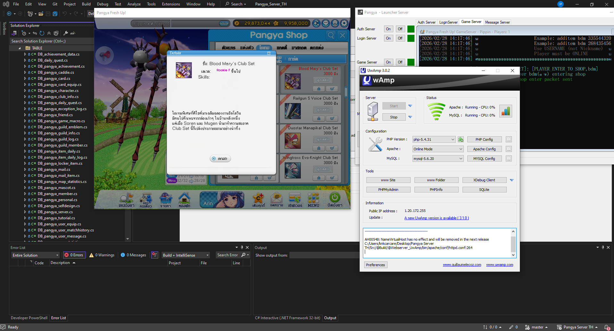

# Pangya Server S8 TH



> Project based on the Thai (TH) version of Pangya S8

## About

Server developed in C#, targeting **.NET Framework 4.8**, based on the original Pangya TH source.  
Originally ported from **MS SQL** to **MySQL 8.0** and extended with additional game mode support.

> **Credits:** Based on [Py_Source_TH](https://github.com/luismk/Py_Source_TH) by [@luismk](https://github.com/luismk)

---

## Development Status

| Area | Status | Notes |
|---|---|---|
| Database | ✅ Complete | Migrated from MS SQL → MySQL 8.0 (EF6 + MySql.Data 8.0.33) |
| AuthServer | ✅ Working | Server sync, inter-server registration |
| LoginServer | ✅ Working | Player login & authentication |
| Messenger | ✅ Working | Social / friend system |
| Single-player modes | ✅ Complete | All modes playable (see table below) |
| Multiplayer (Versus Stroke) | ⚠️ Partial | Turn system implemented, sync issues remain |
| Multiplayer (other modes) | ❌ Incomplete | Logic not yet fully correct |

---

## Gameplay Modes

### Single Player (Solo) — ✅ Complete

| Mode | Class | Status | Description |
|---|---|---|---|
| Practice (Stroke Repeat) | `PracticeMode` | ✅ | Full hole completion, EXP/Pang, ball consumption |
| Chip-In Practice | `PracticeChip` | ✅ | Chip-in scoring, EXP, ball tracking |
| Chat Room | `ModeChatRoom` | ✅ | In-room shop, player actions |

### Multiplayer — ⚠️ Partial / ❌ Incomplete

| Mode | Class | Status | Notes |
|---|---|---|---|
| Versus Stroke | `ModeVersus` | ⚠️ | Turn system, shot sync, hole progression implemented — sync not fully stable |
| Versus Match | — | ❌ | Not yet implemented |
| Grand Prix | — | ❌ | Config flag exists (`Property=2048`), gameplay not complete |
| Tournament | — | ❌ | Stub only |

### Known Multiplayer Issues

- Shot sync (`PlayerSyncShot`) can time out — auto-force-sync fallback exists but may cause desync
- Ball position broadcast (`0x6E`) is sender-only in Versus mode — other players do not see opponents' balls move
- `PlayerHoleData` turn order depends on distance calculation which may produce incorrect results on first hole
- Game result screen (`SendGameResult`) may not display correctly for all players

---

## Projects

| Project | Description |
|---|---|
| `AuthServer` | Authentication/sync server — must be started **first** |
| `LoginServer` | Handles player login and authentication |
| `GameServer` | Main game server |
| `Messenger` | Messenger / social server |
| `PangyaAPI` | Shared API layer (TCP server, crypto, packets) |
| `PangyaFileCore` | IFF file reader and game data manager |
| `MySQL` | Database connector (Entity Framework 6 + MySQL 8.0) |
| `@Launcher` | GUI launcher to start all servers at once |

---

## Requirements

| Software | Purpose |
|---|---|
| [Visual Studio 2022](https://visualstudio.microsoft.com/) | Build and run the solution |
| [uWamp](https://www.uwamp.com/en/) | Web + MySQL server (Apache, MySQL 5.6, PHP) |
| [Pangya TH Client 829.01](https://drive.google.com/file/d/0B_RaG0yzITpITkxDTFhWNHBNdWM/view) | Game client |

---

## Directory Structure

```
Src/
├── @Build/                  ← Compiled output — run all servers from here
│   ├── AuthServer.exe
│   ├── LoginServer.exe
│   ├── GameServer.exe
│   ├── Messenger.exe
│   ├── @Launcher.exe        ← GUI launcher
│   ├── Auth.ini
│   ├── Login.ini
│   ├── Game.ini
│   ├── Msg.ini
│   └── @Webserver_UwAmp/   ← Bundled uWamp web server
├── AuthServer/
├── Login/
├── Game/
│   └── Game/
│       └── Game/
│           ├── GameBase.cs         ← Abstract base for all game modes
│           └── Modes/
│               ├── PracticeMode.cs     ← Solo stroke repeat
│               ├── PracticeChip.cs     ← Solo chip-in
│               ├── ModeVersus.cs       ← Multiplayer versus stroke
│               └── ModeChatRoom.cs     ← Chat room with shop
├── Messenger/
├── PangyaAPI/
├── PangyaFileCore/
├── Connector/               ← MySQL project
└── Server_Launcher/         ← @Launcher source
```

---

## Installation

### 1. Database Setup

1. Start **uWamp** (or use the bundled `@Webserver_UwAmp` inside `@Build`)
2. Open **phpMyAdmin** at `http://localhost/phpmyadmin`
3. Create a database named `pangya`
4. Import the SQL schema from `@Build/@Webserver_UwAmp/bin/database/`
5. Default credentials used by all servers:
   - Host: `127.0.0.1` · Port: `3306`
   - Database: `pangya` · User: `root` · Password: `root`

### 2. Building the Solution

1. Open the solution in **Visual Studio 2022**
2. Restore NuGet packages (`Tools → NuGet Package Manager → Restore`)
3. Build the solution (`Ctrl+Shift+B`)
4. All output files are placed in `Src/@Build/`

### 3. Configuration

Each server reads its settings from an `.ini` file located in `Src/@Build/`.

| Server | Config File | Default Port |
|---|---|---|
| `AuthServer` | `Auth.ini` | `7997` |
| `LoginServer` | `Login.ini` | `10201` |
| `GameServer` | `Game.ini` | `20201` |
| `Messenger` | `Msg.ini` | `30303` |

> The `AuthServer` internal sync port (used by other servers to connect) is **`7777`** by default.  
> Update `AuthServer_Port` in `Login.ini`, `Game.ini`, and `Msg.ini` if you change it.

#### Example: `Auth.ini`
```ini
[Config]
Name=AuthServer
Port=7997
IP=127.0.0.1
MaxPlayers=500

[NORMAL_DB]
DBENGINE=mysql
DBIP=127.0.0.1
DBNAME=pangya
DBUSER=root
DBPASS=root
DBPORT=3306
```

#### Game.ini — notable options

| Key | Description |
|---|---|
| `Property` | Server type flag (e.g. `2048` = Grand Prix) |
| `EventFlag` | Active event flags (e.g. `4` = EXP ×2, `2` = Pang boost) |
| `ChannelCount` | Number of lobby channels |
| `Messenger_Server` | Enable/disable Messenger integration (`true`/`false`) |
| `BlockFuncSystem` | Block specific server functions (`0` = none) |

### 4. Running the Servers

> ⚠️ **AuthServer must be started first** — all other servers register through it.

#### Option A — GUI Launcher
Run `@Build/@Launcher.exe` to start all servers from a single interface.

#### Option B — Manual (in order)
```
1. AuthServer.exe
2. LoginServer.exe
3. Messenger.exe
4. GameServer.exe
```

---

## Server Ports Summary

| Server | Port |
|---|---|
| AuthServer (client connections) | `7997` |
| AuthServer (inter-server sync) | `7777` |
| LoginServer | `10201` |
| GameServer | `20201` |
| Messenger | `30303` |

---

## Changelog

### Current Version
- **Database:** Migrated from MS SQL to MySQL 8.0
- **Single-player modes:** All modes fully playable (Practice Stroke, Chip-In Practice)
- **PracticeMode:** Shot processing, OB penalty, ball consumption, EXP/Pang calculation, hole progression
- **PracticeChip:** Chip-in scoring, anti-cheat pang delta check, EXP generation
- **ModeVersus (Multiplayer):** Turn-based system, shot sync with timeout fallback, distance-based turn order, per-hole player ordering — *partially functional, sync not fully stable*
- **Ball consumption:** Special ball depletion with fallback to default ball
- **GameBase:** Added `SendExcept()`, virtual `PlayerHoleData()`, artifact setting disabled

---

## License

This project is for **educational purposes only**.  
All rights related to Pangya belong to their respective owners.
